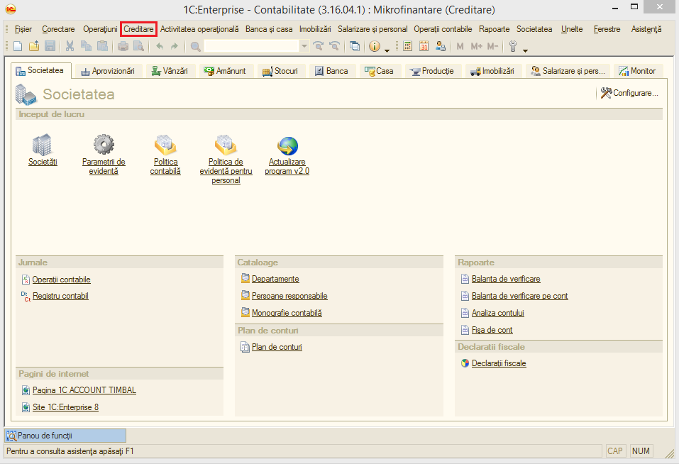

1.Introducere în modulul de Creditare
=====================================

Modulul de Creditare a fost dezvoltat pe platforma 8.2 și integrat în
programul 1C:Contabilitate.Scopul acestui modul este de a veni în
ajutorul societăților de microfinanțare care desfășoară activități
specifice operațiunii de creditare.În acest sens, s-a încercat o
armonizare între programul inițial de contabilitate și modulul de
Creditare la cererea clienților ce desfășoară un astfel de obiect de
activitate.Totodată, aplicația este concepută să raspundă cerințelor
managementului companiei prin furnizarea de analize, statistici și
rapoarte atât economico-financiare cât și contabile, conforme cu
legistlația în vigoare.

***Atenție!** Menţionăm încă de la început că modalităţile prezentate
nu exploatează toate facilităţile oferite de **modulul de Creditare**,
având drept scop doar familiarizarea cu funcțiile de bază.

Înregistrarea informațiilor de bază ale unei societăți se realizează
prin introducerea datelor inițiale și a fluxului de documente contabile
așa cum este descris deja în manualul de utilizare al programului
1C:Contabilitate.

În cele ce urmează vom realiza o scurtă prezentare a operațiunilor
specifice modulului de Creditare.

Se deschide programul 1C:Contabilitate și se accesează modulul
**Creditare** din bara de sus.

|image1|

