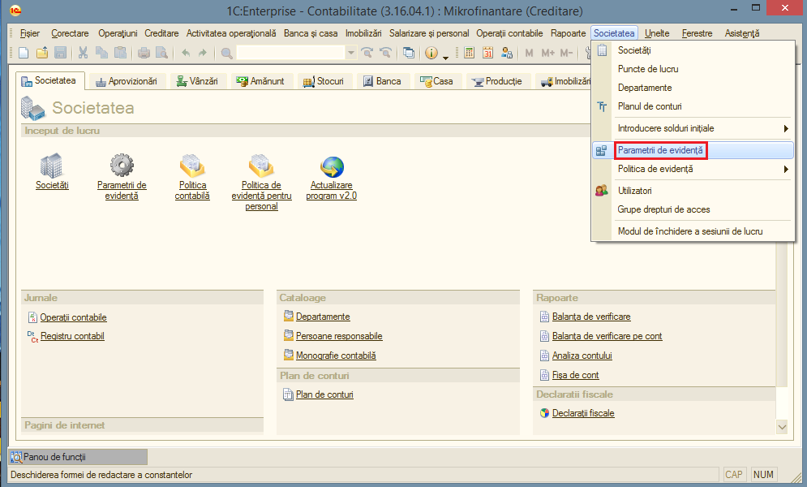
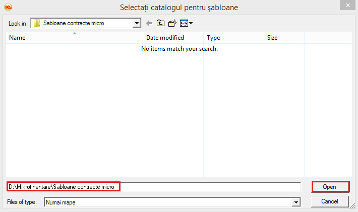
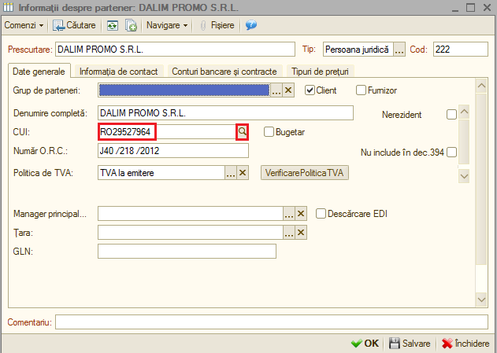
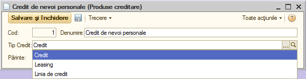
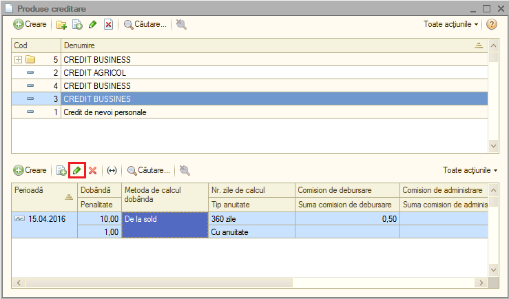

2.Clasificatoare
================

Acest modul cuprinde funcții precum:„Clasificatoare”, „Documente”,
„Rapoarte”, „Altele”, care la rândul lor sunt detaliate.

|C:UsersCristinaBulatDesktopPoze MicrofinantareImage 53.png|

În primă fază sunt necesare câteva setări pentru a lucra eficient în
modulul de Creditare. Una dintre setări este reprezentată de
configurarea șabloanelor aferente contractelor de credit.

|image3|

Se accesează „Societatea” – „Parametrii de evidență” – ne poziționăm pe
fila „Microfinanțare”.

|C:UsersCristinaBulatDesktopPoze MicrofinantareImage 43.png|

În câmpul „Mapa pentru șabloane” se adaugă folderul ce conține
șabloanele contractelor de creditare. Acestea sunt de două tipuri:
contract de credit pentru persoana juridică și contract de credit pentru
persoana fizică. La final se apasă butonul „OK”.

|image5|

Se vor adăuga apăsând butonul „Adăugare”, contractanții (persoanele care
solicită creditul). Se accesează „Creditare” – „Clasificatoare” –
„Contractanți”. Acest lucru se poate realiza automat, în mod similar cu
adăugarea partenerilor (Clienți/Furnizori), prin introducerea Codului
Unic de Identificare (CUI). Programul va prelua automat informațiile
contractantului existente la acel moment de pe site-ul M-finanțe.
Important este să se introducă și contul/conturile bancare ale
contractantului.

|image6|

Creditul, gaj-ul și tipurile de gaj sunt aspecte care vor fi generate în
urma realizării Cererii de creditare.

Produsele noi de creditare se pot adăuga în lista inițială de
produse,accesând: „Creditare” – „Clasificatoare” – „Produse creditare”
și apoi apăsând butonul „Creare”.

|C:UsersCristinaBulatDesktopPoze MicrofinantareImage 5.png|

Odată cu introducerea unui nou produs de creditare, se vor specifica Denumirea, Tipul de Credit, precum și categoria din care face parte (Părintele).
-----------------------------------------------------------------------------------------------------------------------------------------------------

|image8|

Este necesară adăugarea template-urilor pentru produsele de creditare.
În acest sens, ne poziționăm pe produsul de creditare. Selectăm în
partea de jos a produsului de creditare, apăsăm butonul „Modificare” și
ne poziționăm pe fila „Fișiere”.

|image9|

În câmpurile „Șablon contract de credit-companie” și „Șablon contract de
credit persoane fizice” se vor introduce șabloanele celor două tipuri de
contracte de credit, apăsând butonul „Selectare”.

|C:UsersCristinaBulatDesktopPoze MicrofinantareImage 46.png|

|C:UsersCristinaBulatDesktopPoze MicrofinantareImage 47.png|

Totodată se pot adăuga informațiile produselor de creditare, precum:
rata dobânzii, metoda calculului dobânzii, anuitatea, comisionul de
debursare, etc, prin accesarea „Creditare” – „Clasificatoare” – „Produse
creditare” – apăsarea butonului „Creare” în partea de jos.

|C:UsersCristinaBulatDesktopPoze MicrofinantareImage 9.png|

De asemenea se pot adăuga Sectoarele economice aferente creditării.

|C:UsersCristinaBulatDesktopPoze MicrofinantareImage 10.png|

Scopul operațiunii de creditare se introduce în mod similar: „Creditare”
– „Clasificatoare” – „Scopurile creditelor”.

|C:UsersCristinaBulatDesktopPoze MicrofinantareImage 11.png|

Acordarea creditelor trebuie să fie aprobată de către Comitetul de
creditare format din membrii de comitet și președinte.

|C:UsersCristinaBulatDesktopPoze MicrofinantareImage 12.png|

|C:UsersCristinaBulatDesktopPoze MicrofinantareImage 14.png|

