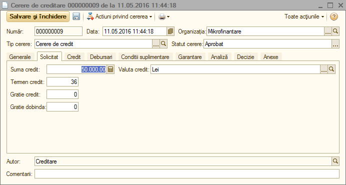
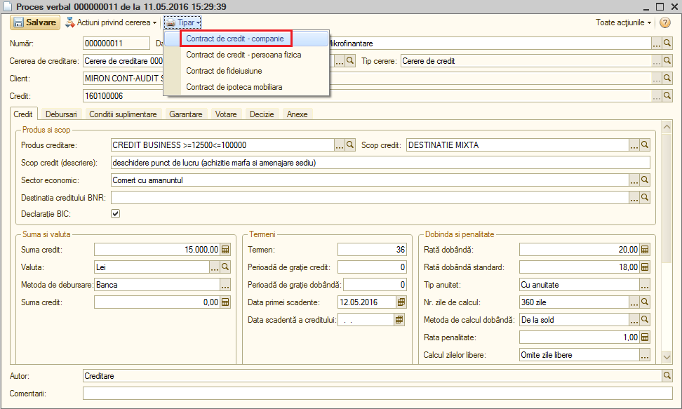

3.Documente
===========

Fluxul de documente aferent operațiunii de creditare este format din:„Cerere de credit”, „Proces verbal”, „Setarea datelor creditelor”, „Dispoziția de debursare”, „Planul portofoliului de credite”.

3.1 Cererea de creditare
------------------------

Modalitatea de accesare a cererii de creditare este: „Creditare” –
„Documente” – „Cerere de creditare”.

|Image 15.png|

O nouă cerere de creditare se adaugă, apăsând butonul „Creare”.

|Image 16.png|

Se vor completa pe rând filele cele mai importante din cererea de
creditare, și anume: „Generale”, „Solicitat”, „Credit”, „Debursări”,
„Garantare”, „Decizie”.

|Image 17.png|

Fila „Solicitat” cuprinde informații despre creditul care urmează a fi
acordat: „Sumă credit”, „Valută credit”, „Termen credit”.

|Image 19.png|

Fila „Credit” oferă informații referitoare la tipul de credit și limita
în care trebuie să se încadreze. Scopul creditului descoperă destinația
unde acesta va fi folosit. Se va bifa „Declarație BIC” și se va apăsa
butonul „Creează credit”. La final se apasă butonul „Validare și
închidere”. Se redeschide documentul și se accesează „Acțiuni privind
cererea” - „Transmitere la comitet”, pentru a se analiza riscul
operațiunii de creditare și eligibilitatea clientului căruia i se va
acorda creditul.

|image21|

Fluxul de documente constă în cele ce urmează în deschiderea
documentului de creditare, apăsând butonul „Acțiuni privind cererea” -
„Creează setarea datelor”.

|image22|

Înainte de setarea datelor se procedează la „Aprobarea cererii”. În
acest scop, se apasă pe butonul „Creditare” – „Documente” – „Proces
verbal” – se selectează procesul verbal și se apasă butonul „Acțiuni
privind cererea” – „Aprobarea cererii”.

Este necesar a se configura „Parametrii de calcul”, și anume: rata
dobânzii, anuitatea, numărul zilelor de calcul, procentul de penalitate
și comisionul de debursare.

|Image 27.png|

Setarea datelor are un rol foarte important în ceea ce privește
preluarea automată a informațiilor necesare în „Generarea graficului” și
în „Dispoziția de debursare”.

|image24|

Ca rezultat al apăsării butonului „Aprobarea cererii”, va apărea
fereastra de mai jos.

|Image 25.png|

În momentul în care se deschide procesul verbal („Creditare” –
„Documente” – „Proces verbal”), se apasă butonul „Tipar” și se
selectează „Contract credit – companie” sau „Contract credit – persoană
fizică”.

|image26|

La final se apasă butonul „Tipar” pentru generarea contractului și
imprimarea acestuia.

|Image 49.png|

|Image 50.png|

Se aduce în document „Procesul verbal” aferent „Cererii de creditare” și
apoi se apasă butonul „Aprobare setare de date”, se completează data
debursării și se generează graficul.

|Image 26.png|

După Generarea graficului se are în vedere crearea dispoziției de
debursare apăsând butonul „Creditare” –„Documente” – „Dispoziție de
debursare”.

|image30|

În Dispoziția de debursare se vor completa procesul verbal, decizia
comitetului, data de aprobare și de debursare și metoda de
debursare:Casiere/Bancă.Programul va genera automat valoarea creditului,
rata comisionului de debursare, suma comisionului și dobânda calculată.

|image31|

La accesarea butonului „Debursare” se va genera „Ordinul de plată”.În
acest document vor fi specificate data ordinului de plată, seria și
numărul documentului, contul bancar, contractul clientului și suma
aferentă creditării.La final se apasă butonul „OK” (Validare).

|Image 33.png|

Pe fila Suplimentar a „Ordinului de plată”, se va realiza caracterizarea
contabilă.Utilitatea caracterizării contabile este reprezentată de
înregistrarea corectă a acordării creditului.Această operațiune
presupune atribuirea conturilor corespunzătoare (preluarea conturilor se
realizează din planul de conturi), după cum urmează:

Tip de credit acordat – se va stabili contul în corelație cu destinația
creditului acordat (în speță 205.1);

Cont Venituri Comision – 702.9;

Tip venituri – comisioane de debursare;

Creanțe atașate – 205.7;

Venituri în avans – 376.

Creditul și dobânda sunt completate automat din celelalte documente în
Ordinul de plată.În urma apăsării butonul „OK”, apare o fereastră cu
regimul de validare.Se va selecta Validare neoperativă și se apasă OK.

|image33|

Următoarea etapă în fluxul de operații este stingerea Ordinului de plată
prin Extrasul bancar.Se accesează butonul „Banca și casa” – „Extras de
cont” – „Adăugare” – „Ordin de plată” – „Adăugare după Ordin de plată”.

|Image 37.png|

Ca rezultat al apăsării acestui buton se va deschide lista cu Ordinele
de plată.Se va selecta Ordinul de plată care se dorește a se închide
prin Extras de cont prin dublu click.

|Image 38.png|

Se adaugă suma de ieșire și se scrie explicația în câmpul
„Reprezentând”.La sfârșit se apasă butonul „OK”, având rol în generarea
notei contabile.

|image36|

Cu alte cuvinte, operațiunea de acordare a creditului se închide cu
plata acestuia prin extrasul de cont.

